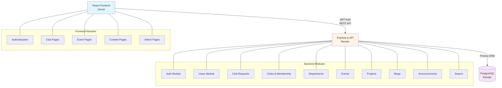
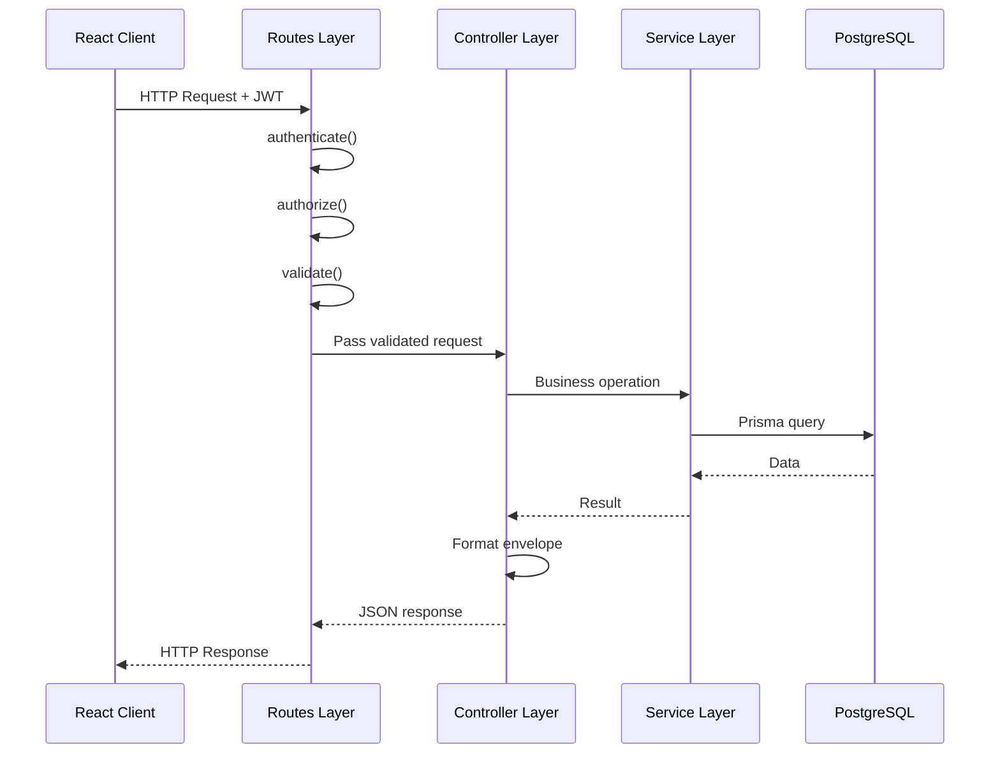
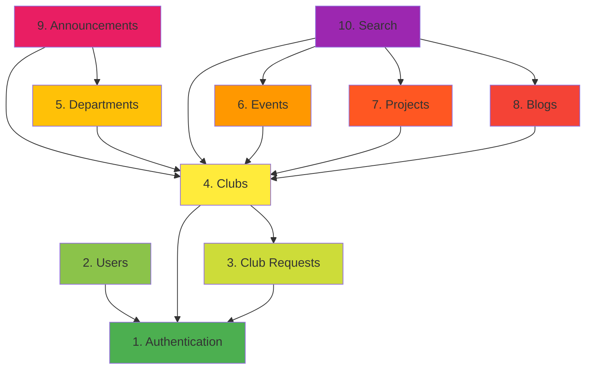
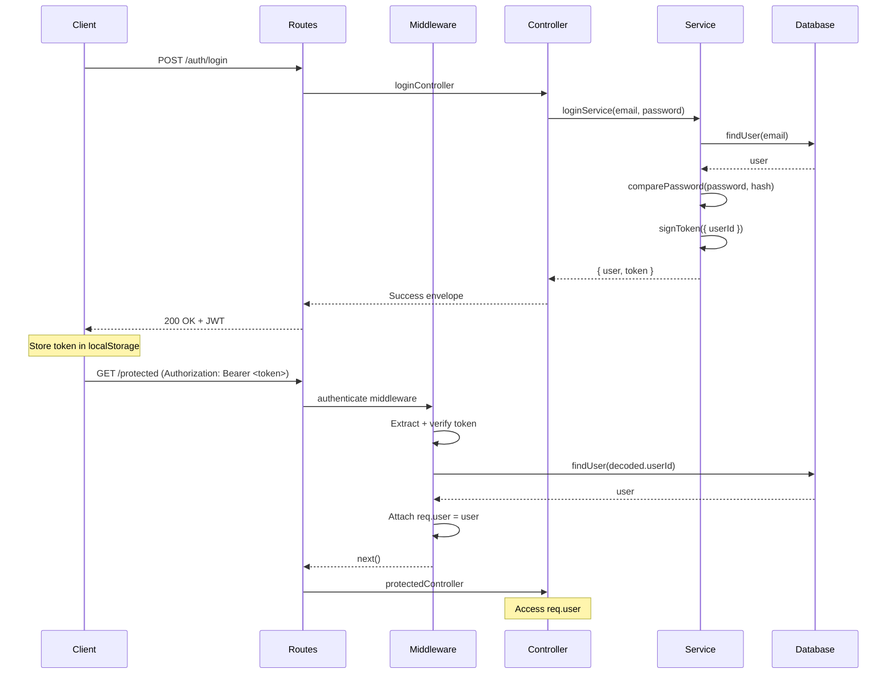
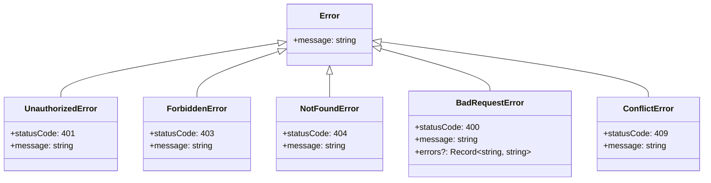
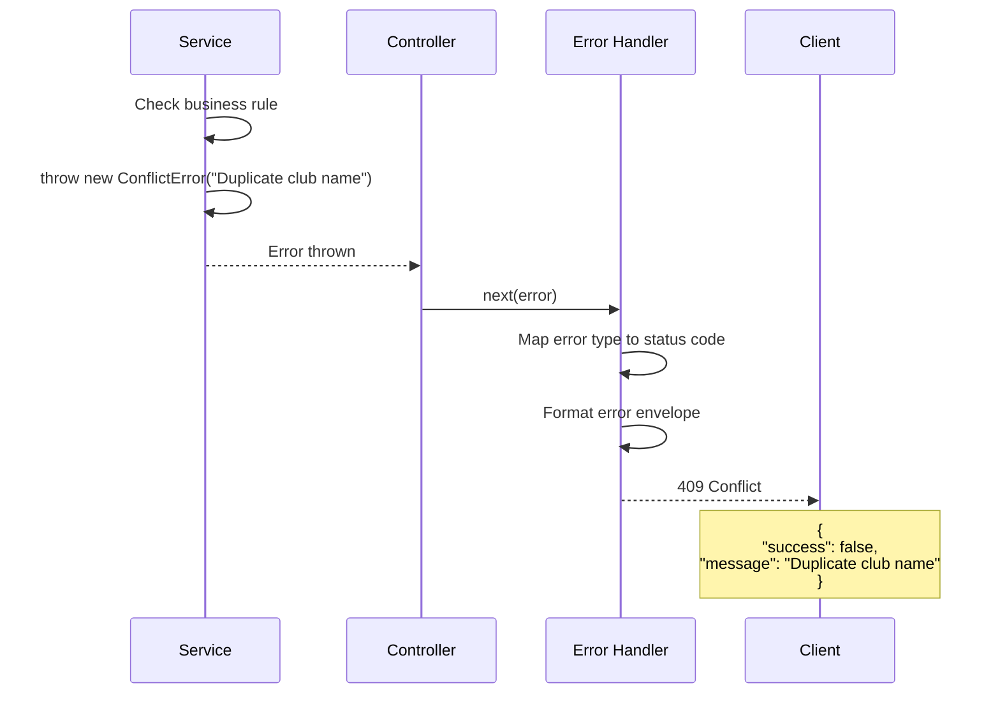

# Design Document: CampusOS MVP Implementation

## Overview

CampusOS is a campus management platform designed to streamline club operations, event management, project showcasing, and campus-wide communication. The system implements a modular monolith architecture with a three-layer pattern (Routes → Controllers → Services) using Express.js, Prisma ORM, and PostgreSQL.

The platform serves four primary user roles:
- **Students**: Browse clubs, register for events, view content
- **Club Heads**: Manage club operations, request events, publish content
- **Faculty Coordinators**: Approve club event requests
- **Super Admins**: Platform-wide administration, club request approval, role management

This design document outlines the complete system architecture, component interactions, data models, and implementation strategy for a one-week MVP delivery, optimized for parallel team development.

---

## Architecture

### System Architecture Diagram



### Three-Layer Architecture Pattern



**Layer Responsibilities:**

1. **Routes Layer** (`routes.ts`)
   - HTTP verb/path mapping
   - Middleware application (auth, validation)
   - No business logic or database access

2. **Controller Layer** (`controller.ts`)
   - Request parsing (body, params, query)
   - Service orchestration
   - Response envelope formatting
   - No business logic or database access

3. **Service Layer** (`service.ts`)
   - Business logic implementation
   - Database transactions via Prisma
   - Domain rule enforcement
   - Error throwing (domain-specific errors)

---
## Components and Interfaces

### Backend Module Architecture

Each module follows identical structure for consistency and parallel development:

```
modules/{feature}/
├── routes.ts       # Express Router with middleware
├── controller.ts   # Request handlers
├── service.ts      # Business logic + database access
└── schemas.ts      # Validation schemas (zod)
```

**Module Dependency Graph:**



**Build Order (for parallel development):**
1. **Phase 1** (no dependencies): Authentication
2. **Phase 2** (depends on Auth): Users, Club Requests + Clubs (can be parallel)
3. **Phase 3** (depends on Clubs): Departments, Events, Projects, Blogs (can be parallel)
4. **Phase 4** (depends on multiple): Announcements (depends on Clubs + Departments)
5. **Phase 5** (depends on all content): Search (depends on Clubs, Events, Projects, Blogs)

---
### Core Module Interfaces

#### Authentication Module

**Routes:**
```typescript
POST   /api/v1/auth/register
POST   /api/v1/auth/login
GET    /api/v1/auth/me
```

**Key Interfaces:**
```typescript
interface RegisterRequest {
  name: string;           // 2-80 chars
  email: string;          // valid, unique
  password: string;       // ≥8 chars
}

interface LoginRequest {
  email: string;
  password: string;
}

interface AuthUser {
  id: string;
  name: string;
  email: string;
  platformRole: 'SUPER_ADMIN' | 'FACULTY_COORDINATOR' | 'STUDENT';
  clubMemberships?: ClubMembership[];  // Only in GET /auth/me
}

interface ClubMembership {
  clubId: string;
  clubName: string;
  role: 'CLUB_HEAD' | 'MEMBER';
  department: {
    id: string;
    name: string;
  } | null;
}
```

**Responsibilities:**
- User registration (default role: STUDENT)
- User authentication (email/password)
- JWT token generation (expires in 7 days)
- Current user profile resolution with club memberships

---
#### Club Requests + Clubs Module

**Routes:**
```typescript
// Club Requests
POST   /api/v1/club-requests
GET    /api/v1/club-requests?status=PENDING
GET    /api/v1/club-requests/:id
PATCH  /api/v1/club-requests/:id/approve
PATCH  /api/v1/club-requests/:id/reject
DELETE /api/v1/club-requests/:id

// Clubs
POST   /api/v1/clubs
GET    /api/v1/clubs?search=&page=1&limit=20
GET    /api/v1/clubs/:id
PATCH  /api/v1/clubs/:id
PATCH  /api/v1/clubs/:id/faculty-coordinator

// Membership
GET    /api/v1/clubs/:id/members
POST   /api/v1/clubs/:id/members
DELETE /api/v1/clubs/:id/members/:userId
PATCH  /api/v1/clubs/:id/members/:userId/role
POST   /api/v1/clubs/:id/transfer-head
```

**Key Interfaces:**
```typescript
interface ClubRequest {
  id: string;
  clubName: string;
  description: string;
  facultyDetails: string;
  reason: string;
  requestedBy: string;
  status: 'PENDING' | 'APPROVED' | 'REJECTED';
  reviewedBy?: string;
  rejectionReason?: string;
  createdAt: string;
}

interface Club {
  id: string;
  name: string;
  description: string;
  facultyDetails: string;
  socialLinks: {
    instagram?: string;
    linkedin?: string;
    github?: string;
    website?: string;
  };
  logoUrl?: string;
  status: 'ACTIVE';
  facultyCoordinatorId?: string;
  createdAt: string;
}

interface ClubMember {
  userId: string;
  name: string;
  email?: string;        // Only for Club Head/Super Admin
  role: 'CLUB_HEAD' | 'MEMBER';
}
```

**Responsibilities:**
- Club creation request workflow (submit → approve/reject → create club)
- Direct club creation (Super Admin bypass)
- Club membership management (add, remove, demote)
- Club Head transfer (atomic role swap)
- Faculty Coordinator assignment (one per club)

**Critical Business Rules:**
- Exactly one Club Head per club at all times
- Club name uniqueness (case-insensitive)
- Faculty Coordinator can coordinate only one club
- Cannot remove sole Club Head

---
#### Events Module

**Routes:**
```typescript
POST   /api/v1/clubs/:id/events
PATCH  /api/v1/clubs/:id/events/:eventId
GET    /api/v1/events?search=&status=&type=&clubId=
GET    /api/v1/events/:id
PATCH  /api/v1/events/:id/approve
PATCH  /api/v1/events/:id/reject
POST   /api/v1/events/:id/register
DELETE /api/v1/events/:id/register
GET    /api/v1/events/:id/registrations
```

**Key Interfaces:**
```typescript
interface Event {
  id: string;
  clubId: string;
  title: string;
  description: string;
  location: string;
  type: 'PUBLIC' | 'CLUB_EXCLUSIVE';
  capacity: number | null;    // null = unlimited
  registeredCount: number;
  startTime: string;
  endTime: string;
  status: 'PENDING' | 'APPROVED' | 'REJECTED';
  requestedBy: string;
  reviewedBy?: string;
  rejectionReason?: string;
  createdAt: string;
}

interface EventRegistration {
  eventId: string;
  userId: string;
  registeredAt: string;
}
```

**Responsibilities:**
- Event request/approval workflow (Club Head → Faculty Coordinator)
- Event registration management (capacity checking, visibility filtering)
- Event editing (PENDING/REJECTED only, resets to PENDING)
- Registrant list viewing (Club Head/Faculty Coordinator)

**Critical Business Rules:**
- Only APPROVED events can accept registrations
- PUBLIC events: visible to all, anyone can register
- CLUB_EXCLUSIVE events: visible to club members only, members only can register
- Capacity enforcement (transaction-safe concurrent registration)
- Editing APPROVED events is forbidden

---
## Data Models

### Database Schema Overview

**11 Core Tables:**
1. `users` - User accounts and platform roles
2. `club_creation_requests` - Pending club approval queue
3. `clubs` - Active clubs
4. `club_memberships` - User-club relationships with roles
5. `departments` - Club sub-units
6. `department_memberships` - User-department relationships
7. `events` - Event requests and registrations
8. `event_registrations` - User event sign-ups
9. `projects` - Club project showcases
10. `blogs` - Blog posts
11. `announcements` - Platform/club/department announcements

**Enumerated Types:**
- `PlatformRole`: SUPER_ADMIN, FACULTY_COORDINATOR, STUDENT
- `ClubRole`: CLUB_HEAD, MEMBER
- `ClubStatus`: ACTIVE
- `RequestStatus`: PENDING, APPROVED, REJECTED
- `EventType`: PUBLIC, CLUB_EXCLUSIVE
- `EventStatus`: PENDING, APPROVED, REJECTED
- `ProjectStatus`: IN_PROGRESS, COMPLETED, ARCHIVED
- `AnnouncementVisibility`: GLOBAL, CLUB, DEPARTMENT

---

### Entity Relationship Diagram

```mermaid
erDiagram
    users ||--o{ club_creation_requests : "requests"
    users ||--o{ club_memberships : "member_of"
    users ||--o{ department_memberships : "dept_member"
    users ||--o{ event_registrations : "registers_for"
    users ||--o{ projects : "creates"
    users ||--o{ blogs : "authors"
    users ||--o{ announcements : "posts"
    users ||--o| clubs : "coordinates"
    users ||--o| departments : "heads"
    
    clubs ||--o{ club_memberships : "has_members"
    clubs ||--o{ departments : "contains"
    clubs ||--o{ events : "hosts"
    clubs ||--o{ projects : "publishes"
    clubs ||--o{ blogs : "publishes"
    clubs ||--o{ announcements : "scopes"
    
    departments ||--o{ department_memberships : "has_members"
    departments ||--o{ projects : "categorizes"
    departments ||--o{ blogs : "categorizes"
    departments ||--o{ announcements : "scopes"
    
    events ||--o{ event_registrations : "has_registrations"
    
    users {
        uuid id PK
        string name
        string email UK
        string password_hash
        enum platform_role
        timestamp created_at
    }
    
    clubs {
        uuid id PK
        string name UK
        text description
        jsonb social_links
        string logo_url
        enum status
        uuid faculty_coordinator_id FK_UK
    }
    
    events {
        uuid id PK
        uuid club_id FK
        string title
        enum type
        int capacity
        timestamp start_time
        timestamp end_time
        enum status
        uuid requested_by FK
    }
```

---
### Key Data Model Constraints

#### Foreign Key Cascade Rules

| Child Table | Parent Table | FK Column | On Delete |
|---|---|---|---|
| club_memberships | users | user_id | CASCADE |
| club_memberships | clubs | club_id | CASCADE |
| department_memberships | users | user_id | CASCADE |
| department_memberships | departments | department_id | CASCADE |
| departments | clubs | club_id | CASCADE |
| departments | users | head_user_id | SET NULL |
| events | clubs | club_id | CASCADE |
| events | users | requested_by | RESTRICT |
| event_registrations | events | event_id | CASCADE |
| projects | clubs | club_id | CASCADE |
| projects | departments | department_id | SET NULL |
| blogs | clubs | club_id | CASCADE |
| announcements | clubs | club_id | CASCADE |
| announcements | departments | department_id | CASCADE |

#### Unique Constraints

- `users.email` - Email uniqueness
- `clubs.name` - Club name uniqueness (case-insensitive via functional index)
- `clubs.faculty_coordinator_id` - One coordinator per club
- `(club_memberships.user_id, club_id)` - No duplicate memberships
- `(department_memberships.user_id, department_id)` - No duplicate dept memberships
- `(event_registrations.event_id, user_id)` - No duplicate registrations
- `(departments.club_id, name)` - Department name unique per club (case-insensitive)

#### Check Constraints

- `events.capacity` - NULL or > 0
- `events.end_time` - Must be after `start_time`

---
## Authentication and Authorization Flow

### JWT Authentication Sequence



**Authentication Middleware:**
```typescript
// middleware/authenticate.ts
async function authenticate(req, res, next) {
  // 1. Extract JWT from Authorization header
  const token = req.headers.authorization?.replace('Bearer ', '');
  
  // 2. Verify token signature
  const decoded = jwt.verify(token, JWT_SECRET);
  
  // 3. Fetch user from database (fresh role data)
  const user = await prisma.user.findUnique({
    where: { id: decoded.userId },
    select: { id, email, name, platform_role }
  });
  
  // 4. Attach to request
  req.user = user;
  next();
}
```

---
### Authorization Levels

#### Level 1: Public Endpoints
- No authentication required
- Examples: GET /clubs, GET /events (with visibility filtering), GET /blogs

#### Level 2: Authenticated User
- JWT required, any valid user
- Examples: POST /events/:id/register, GET /announcements

#### Level 3: Platform Role
- JWT + specific platform role (SUPER_ADMIN, FACULTY_COORDINATOR, STUDENT)
- Checked via `authorize(['SUPER_ADMIN'])` middleware
- Examples: POST /clubs (Super Admin only), PATCH /events/:id/approve (Faculty Coordinator)

#### Level 4: Club/Department Role
- JWT + club-scoped or department-scoped role
- Checked via `authorizeClubRole` middleware or controller logic
- Examples: POST /clubs/:id/events (Club Head of that club)

#### Level 5: Custom Logic
- Complex authorization (self OR role, creator OR moderator)
- Checked in controller/service
- Examples: PATCH /users/:id (self OR Super Admin), DELETE /projects/:id (creator OR Club Head)

**Authorization Resolution Priority:**
1. Super Admin bypasses most role checks (platform-wide authority)
2. Club Head/Faculty Coordinator resolved per request from database
3. Department Head derived from `departments.head_user_id` match
4. Self-checks compare `req.user.id` with target resource owner

---
## Error Handling

### Error Hierarchy



### Error Response Flow



**Error Handler Middleware:**
```typescript
// middleware/errorHandler.ts
function errorHandler(error, req, res, next) {
  // Domain-specific errors
  if (error instanceof ConflictError) {
    return res.status(409).json({
      success: false,
      message: error.message
    });
  }
  
  // Prisma errors
  if (error.code === 'P2002') {  // Unique constraint violation
    return res.status(409).json({
      success: false,
      message: 'Duplicate entry'
    });
  }
  
  // Default 500
  return res.status(500).json({
    success: false,
    message: 'Internal server error'
  });
}
```

---
## Testing Strategy

### Unit Testing Approach

**Service Layer Testing:**
- Test business logic in isolation
- Mock Prisma client
- Focus on edge cases and business rule enforcement

**Example Test Structure:**
```typescript
describe('clubService.createClub', () => {
  it('should create club successfully', async () => {
    prismaMock.club.create.mockResolvedValue(mockClub);
    
    const result = await clubService.createClub(clubData);
    
    expect(result).toEqual(mockClub);
    expect(prismaMock.club.create).toHaveBeenCalledWith({
      data: expect.objectContaining(clubData)
    });
  });
  
  it('should throw ConflictError for duplicate name', async () => {
    prismaMock.club.findFirst.mockResolvedValue(existingClub);
    
    await expect(clubService.createClub(clubData))
      .rejects.toThrow(ConflictError);
  });
  
  it('should enforce one Club Head per club', async () => {
    prismaMock.clubMembership.count.mockResolvedValue(1);
    
    await expect(clubService.removeMember(clubId, clubHeadId))
      .rejects.toThrow(BadRequestError);
  });
});
```

**Coverage Goals:**
- Services: 90%+ (critical business logic)
- Controllers: 80%+ (HTTP layer)
- Middleware: 90%+ (security critical)

---

### Integration Testing Approach

**Full HTTP Flow Testing:**
- Test complete request/response cycle
- Use test database
- Verify middleware chain (auth, validation, authorization)

**Example Test Structure:**
```typescript
describe('POST /clubs', () => {
  it('should create club with valid Super Admin token', async () => {
    const response = await request(app)
      .post('/api/v1/clubs')
      .set('Authorization', `Bearer ${superAdminToken}`)
      .send(clubData)
      .expect(201);
    
    expect(response.body.success).toBe(true);
    expect(response.body.data).toHaveProperty('id');
  });
  
  it('should return 401 without token', async () => {
    await request(app)
      .post('/api/v1/clubs')
      .send(clubData)
      .expect(401);
  });
  
  it('should return 403 for non-Super-Admin', async () => {
    await request(app)
      .post('/api/v1/clubs')
      .set('Authorization', `Bearer ${studentToken}`)
      .send(clubData)
      .expect(403);
  });
});
```

---
### Transaction Testing

**Critical Transaction Scenarios:**

1. **Club Request Approval** (3-step atomic operation)
   ```typescript
   it('should atomically create club, membership, and update request', async () => {
     const result = await clubRequestService.approve(requestId, coordinatorId);
     
     // Verify club created
     const club = await prisma.club.findUnique({ where: { id: result.clubId } });
     expect(club).toBeDefined();
     
     // Verify Club Head membership created
     const membership = await prisma.clubMembership.findFirst({
       where: { club_id: result.clubId, role: 'CLUB_HEAD' }
     });
     expect(membership).toBeDefined();
     
     // Verify request updated
     const request = await prisma.clubCreationRequest.findUnique({
       where: { id: requestId }
     });
     expect(request.status).toBe('APPROVED');
   });
   ```

2. **Event Registration Capacity** (race condition prevention)
   ```typescript
   it('should not overbook event under concurrent registrations', async () => {
     // Create event with capacity 2
     const event = await createEvent({ capacity: 2 });
     
     // Attempt 3 concurrent registrations
     const promises = [user1, user2, user3].map(userId =>
       eventService.register(event.id, userId)
     );
     
     const results = await Promise.allSettled(promises);
     
     // Verify exactly 2 succeeded
     const succeeded = results.filter(r => r.status === 'fulfilled');
     const failed = results.filter(r => r.status === 'rejected');
     
     expect(succeeded).toHaveLength(2);
     expect(failed).toHaveLength(1);
   });
   ```

3. **Club Head Transfer** (atomic demotion + promotion)
   ```typescript
   it('should atomically transfer Club Head role', async () => {
     const result = await clubService.transferHead(clubId, newHeadId);
     
     // Verify old head demoted
     const oldMembership = await prisma.clubMembership.findUnique({
       where: { user_id_club_id: { user_id: oldHeadId, club_id: clubId } }
     });
     expect(oldMembership.role).toBe('MEMBER');
     
     // Verify new head promoted
     const newMembership = await prisma.clubMembership.findUnique({
       where: { user_id_club_id: { user_id: newHeadId, club_id: clubId } }
     });
     expect(newMembership.role).toBe('CLUB_HEAD');
   });
   ```

---
## Performance Considerations

### Database Indexing Strategy

**High-Frequency Query Indexes:**
```sql
-- User lookup by email (login)
CREATE UNIQUE INDEX idx_users_email ON users(email);

-- Club membership lookups (authorization)
CREATE INDEX idx_club_memberships_user_id ON club_memberships(user_id);
CREATE INDEX idx_club_memberships_club_id ON club_memberships(club_id);

-- Event filtering (list views)
CREATE INDEX idx_events_status_type ON events(status, type);
CREATE INDEX idx_events_club_id ON events(club_id);

-- Department membership (authorization)
CREATE INDEX idx_department_memberships_user_id ON department_memberships(user_id);

-- Blog/Project browsing
CREATE INDEX idx_blogs_published_at ON blogs(published_at DESC);
CREATE INDEX idx_projects_club_id ON projects(club_id);

-- Search optimization
CREATE INDEX idx_blogs_tags ON blogs USING GIN(tags);
```

**Composite Indexes for Common Queries:**
- `(events.status, events.type)` - Event filtering
- `(club_memberships.user_id, club_memberships.club_id)` - Unique membership constraint + lookup
- `(departments.club_id, LOWER(departments.name))` - Unique department name per club

---

### Query Optimization

**Pagination Pattern:**
```typescript
// Efficient pagination with total count
async function listClubs(page: number, limit: number) {
  const where = { status: 'ACTIVE' };
  
  // Parallel queries
  const [items, total] = await Promise.all([
    prisma.club.findMany({
      where,
      skip: (page - 1) * limit,
      take: limit,
      orderBy: { created_at: 'desc' }
    }),
    prisma.club.count({ where })
  ]);
  
  return {
    items,
    pagination: {
      page,
      limit,
      total,
      totalPages: Math.ceil(total / limit)
    }
  };
}
```

**Selective Field Loading:**
```typescript
// Only load needed fields
const user = await prisma.user.findUnique({
  where: { id },
  select: { id: true, name: true, email: true, platform_role: true }
});

// vs loading all fields (default)
const user = await prisma.user.findUnique({ where: { id } });
```

**Relationship Loading:**
```typescript
// Club detail with departments
const club = await prisma.club.findUnique({
  where: { id },
  include: {
    departments: {
      select: { id: true, name: true }  // Only needed fields
    }
  }
});
```

---
### Caching Strategy (Post-MVP)

**Current MVP Approach:** No caching (database queries on every request)

**Future Optimization Opportunities:**
1. **JWT User Cache**: Cache user profile after token verification (5 min TTL)
2. **Club Membership Cache**: Cache user's club memberships (invalidate on membership change)
3. **Static Content**: Cache public club/event lists (1 min TTL, invalidate on creation)
4. **Search Results**: Cache search queries (30 sec TTL)

**Implementation Note:** Redis caching deferred to post-MVP for operational simplicity.

---

## Security Considerations

### Authentication Security

**Password Hashing:**
- Algorithm: bcrypt
- Cost factor: 10-12 rounds
- Never store or return plain passwords
- Password minimum: 8 characters

**JWT Security:**
- Expiration: 7 days (configurable via `JWT_EXPIRES_IN`)
- Signature algorithm: HS256 (HMAC-SHA256)
- Secret key: Strong random string via environment variable
- No sensitive data in payload (only `userId`)
- Refresh strategy: Out of MVP scope

**Token Storage:**
- Frontend: `localStorage` (XSS risk accepted for MVP)
- Header format: `Authorization: Bearer <token>`
- Token transmitted over HTTPS only (Render enforces SSL)

---

### Authorization Security

**Role Evaluation Rules:**
1. **Never trust JWT claims for club/department roles** - Always query fresh from database
2. **Platform roles resolved per request** - Fetch user.platform_role from database, not from JWT
3. **Super Admin bypass** - Explicitly check and allow in authorization logic
4. **Department Head derived** - Not a stored role, computed from `departments.head_user_id`

**Authorization Failure Behavior:**
- `401 Unauthorized` - Missing/invalid/expired token
- `403 Forbidden` - Valid token, insufficient permissions
- Never reveal existence of resources in error messages (return `404` instead of `403` when appropriate)

---
### Input Validation Security

**Server-Side Validation (Required):**
- All request bodies validated via zod schemas
- URL fields validated against `https?://` regex
- Email validated against RFC 5322 pattern
- String length constraints enforced
- Enum values validated against allowed sets
- Foreign key existence validated before database operations

**Validation Failure Response:**
```json
{
  "success": false,
  "message": "Validation failed",
  "errors": {
    "email": "Invalid email format",
    "password": "Password must be at least 8 characters"
  }
}
```

**SQL Injection Prevention:**
- Prisma ORM parameterizes all queries automatically
- No raw SQL queries in MVP
- User input never directly interpolated into queries

**XSS Prevention:**
- React auto-escapes rendered content
- Backend returns plain JSON (no HTML rendering)
- Content-Security-Policy headers (post-MVP)

---

### CORS Configuration

**Development:**
```typescript
cors({
  origin: 'http://localhost:5173',  // Vite dev server
  credentials: true
})
```

**Production:**
```typescript
cors({
  origin: process.env.CORS_ORIGIN,  // Deployed frontend URL (Vercel)
  credentials: true
})
```

**Security Rules:**
- Restrict API access to deployed frontend only
- Reject requests from unknown origins
- Allow credentials (cookies/auth headers)

---
## Dependencies

### Backend Dependencies

**Core Framework:**
- `express` ^4.18.0 - Web framework
- `cors` ^2.8.5 - CORS middleware
- `helmet` ^7.0.0 - Security headers

**Database:**
- `@prisma/client` ^5.0.0 - ORM client
- `prisma` ^5.0.0 - Schema management and migrations

**Authentication:**
- `jsonwebtoken` ^9.0.0 - JWT generation/verification
- `bcryptjs` ^2.4.3 - Password hashing

**Validation:**
- `zod` ^3.22.0 - Schema validation

**Development:**
- `typescript` ^5.0.0 - Type safety
- `ts-node-dev` ^2.0.0 - Development server
- `@types/express` - Type definitions
- `@types/node` - Node.js type definitions
- `@types/bcryptjs` - bcrypt type definitions
- `@types/jsonwebtoken` - JWT type definitions

**Testing:**
- `jest` ^29.0.0 - Test runner
- `@types/jest` - Jest type definitions
- `ts-jest` ^29.0.0 - TypeScript support for Jest
- `supertest` ^6.3.0 - HTTP testing
- `@types/supertest` - supertest type definitions

---

### Frontend Dependencies

**Core Framework:**
- `react` ^18.2.0
- `react-dom` ^18.2.0
- `react-router-dom` ^6.14.0

**State Management:**
- `@tanstack/react-query` ^4.29.0 - Server state management
- No Redux (Context for auth state only)

**Styling:**
- `tailwindcss` ^3.3.0
- `autoprefixer` ^10.4.14
- `postcss` ^8.4.27

**HTTP Client:**
- `axios` ^1.4.0 - HTTP requests with interceptors

**Development:**
- `vite` ^4.4.0 - Build tool
- `@vitejs/plugin-react` ^4.0.0
- `typescript` ^5.0.0
- `@types/react` - React type definitions
- `@types/react-dom` - ReactDOM type definitions

---
### External Services

**Hosting:**
- **Vercel** - Frontend deployment (React app)
- **Render** - Backend deployment (Express.js API)
- **Render PostgreSQL** - Managed database

**Environment Variables:**

**Backend (Render):**
```bash
DATABASE_URL=postgresql://...           # Render PostgreSQL connection string
JWT_SECRET=<strong_random_string>       # JWT signing key
JWT_EXPIRES_IN=7d                       # Token expiration
CORS_ORIGIN=https://campusos.vercel.app # Frontend URL
NODE_ENV=production                     # Environment
PORT=3000                               # Server port
```

**Frontend (Vercel):**
```bash
VITE_API_BASE_URL=https://campusos-api.onrender.com/api/v1
```

**No External Integrations in MVP:**
- No email service (Resend deferred)
- No file storage (images as URL strings only)
- No OAuth providers (email/password only)
- No analytics (deferred)
- No monitoring (basic Render logs only)

---

## Correctness Properties

### Invariants (Must Always Hold)

#### Club Invariants

**INV-CLUB-1**: Exactly one Club Head per club at all times
```typescript
// Check in removeMember, demoteToMember
const clubHeadCount = await prisma.clubMembership.count({
  where: { club_id: clubId, role: 'CLUB_HEAD' }
});

if (clubHeadCount === 1 && targetMember.role === 'CLUB_HEAD') {
  throw new BadRequestError('Cannot remove sole Club Head');
}
```

**INV-CLUB-2**: Club name uniqueness (case-insensitive)
```typescript
// Check before creating club
const existing = await prisma.club.findFirst({
  where: { name: { equals: clubName, mode: 'insensitive' } }
});

if (existing) {
  throw new ConflictError('Club name already exists');
}
```

**INV-CLUB-3**: Faculty Coordinator uniqueness (one club max)
```typescript
// Check before assigning coordinator
const coordinating = await prisma.club.findUnique({
  where: { faculty_coordinator_id: coordinatorId }
});

if (coordinating) {
  throw new ConflictError('Coordinator already assigned to another club');
}
```

---
